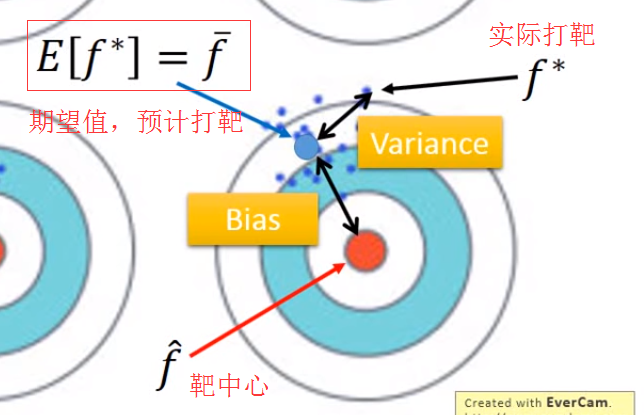
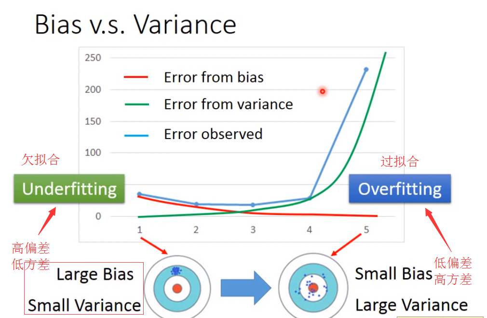
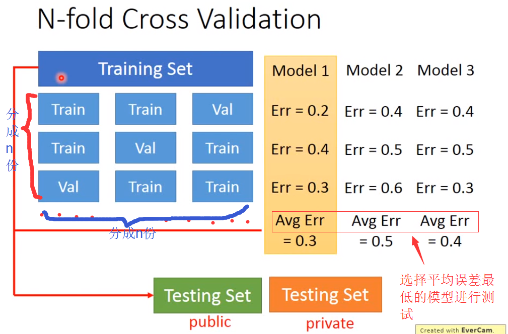

[TOC]

#### 1.错误的来源

* 偏差（bias）：描述的是预测值(估计值)的期望与真实值之间的差距。高偏差对应着欠拟合。
* 方差（variance）：一个随机变量的方差描述的是它的离散程度, 也就是该随机变量在其期望值附近的波动程度。高方差对应着过拟合。
* 噪声(目前没有提到)
  

&nbsp;&nbsp;&nbsp;&nbsp;&nbsp;&nbsp;&nbsp;上图中可以看到期望值可以理解为预计打靶的位置，而偏差（bias）就是预期打靶位置与真实标记靶中心的位置的误差，而方差则是期望打靶位置与实际打靶位置的差距。
##### 过拟合与欠拟合
已知高偏差对应着欠拟合，而高方差对应着过拟合

###### 如何处理高偏差与高方差
* 假设你的模型不能契合训练集的样本，那么称为有**高偏差**。称之为**欠拟合**
* 假设你的模型可以完好的你和训练集，但是在测试集上有较大的错误率，那么说明可能有**高方差**。称之为**过拟合**. 

对于偏差，解决办法如下：重新设计模型
* 增加更多的输入特征
* 生成一个更复杂的模型

对于方差，解决办法如下：
* 加入更多的测试数据
* 使用正则化

##### N折交叉验证

