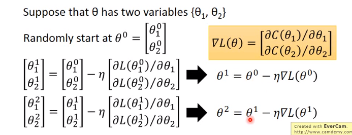
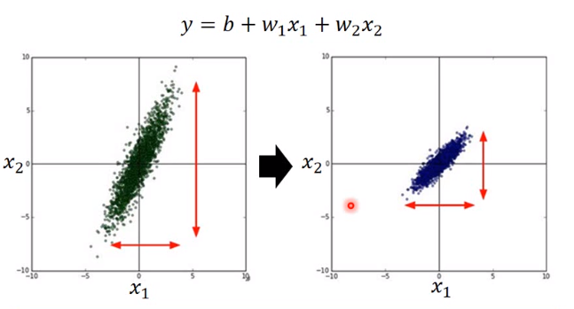
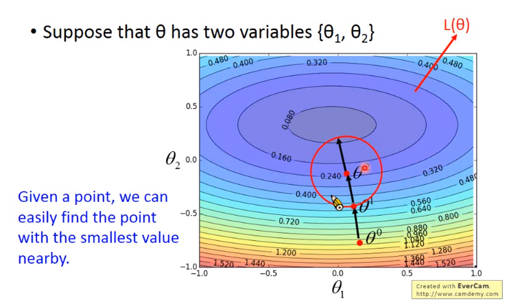
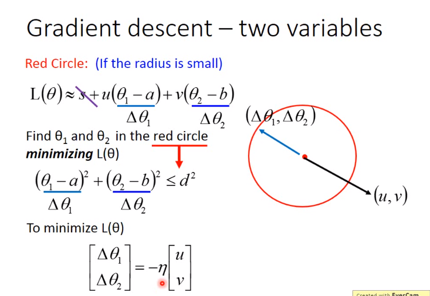

[TOC]

### 梯度下降

我们在确定函数之后，需要找出使损失函数值最小的参数值。即：
$$
\theta^* =argmax_{\theta}L(\theta)\\
其中，L—损失函数，\theta—为参数
$$
假设只有两个参数，则迭代方法如下:

从而一次类推。

##### 如何调整学习率（Learning Rate）

最流行最简单的方法是：学习率自动随着每一次参数的迭代，缩小一点点。

* 在一开始，我们是远离目标的，所以我们使用较高的学习率，使得加快收敛速度。
* 在经过多次迭代之后，我们将离目的地越来越近，所以这个时候减小学习率。

###### 自适应梯度下降

通过使用自适应梯度算法可以实现自动变化学习率：

将每个参数的学习率除以之前算出来的微分值的均方根。

* 梯度下降
  $$
  W^{（t+1）}\leftarrow W^t-\eta^tg^t
  $$

* 自适应梯度下降

$$
W^{（t+1）}\leftarrow W^t-\frac{\eta^t}{\sigma^t}g^t\\
其中\eta^t=\frac{\eta}{\sqrt{t+1}}\\
g^t=\frac{\partial C(\theta^t)}{\partial w}\\
\sigma^t:代表的是过去所有已经计算出来的微分值的均方根\\
再通过简化公式之后可以得到：
W^{（t+1）}\leftarrow W^t-\frac{\eta}{\sum^t_{i=0}(g^i)^2}g^t\\
$$

###### Stochastic Gradient Descent（随机梯度下降）

$$
已知损失函数为L=\sum_n \bigr(y^n-(b+\sum w_ix_{i}^n)\bigr)^2\\
则参数的梯度下降为 \theta^i=\theta^{(i-1)}-\eta\nabla L(\theta^{i-1})\\
首先选择一个样本x^n,\\
只针对样本x^n进行梯度下降的计算\\
则可以得到L^n=\sum_n \bigr(y^n-(b+\sum w_ix_{i}^n)\bigr)^2（上面是将所有的x样本进行计算，而这个公式计算的是只有x^n样本）\\
而参数的梯度下降为 \theta^i=\theta^{(i-1)}-\eta\nabla L^n(\theta^{i-1})
$$

###### Feature Scaling（特征缩放）

如图我们可以看到
$$
x^2上的样本分布得比较散，因此我们可以使用某些特定的方法来对参数进行缩放。
$$
常见方法为：
$$
假设有R个样本，而m_i为所有样本第i个元素的平均值，而\sigma _i表示的是所有样本第i个元素的标准偏差\\
则有x^r_i\leftarrow\frac{x^r_i-m_i}{\sigma_i}
$$

#### 梯度下降的理论

假设给定一个点，如何在一个特定范围内找到可以让损失函数变得更小的参数呢？

##### 泰勒展开式

$$
若函数h(x)在包含x_0的某个闭区间[a,b]上具有n阶导数 (无限次可微)\\
则有：h(x)=\sum^{\infty }_{k=0}\frac{h^{(k)}(x_0)}{k!}(x-x_0)^k(自己把它展开)\\
而当x非常接近x_0的时候，h(x)\approx h(x_0)+h^`(x_0)(x-x_0)
$$

##### 多维泰勒展开式

